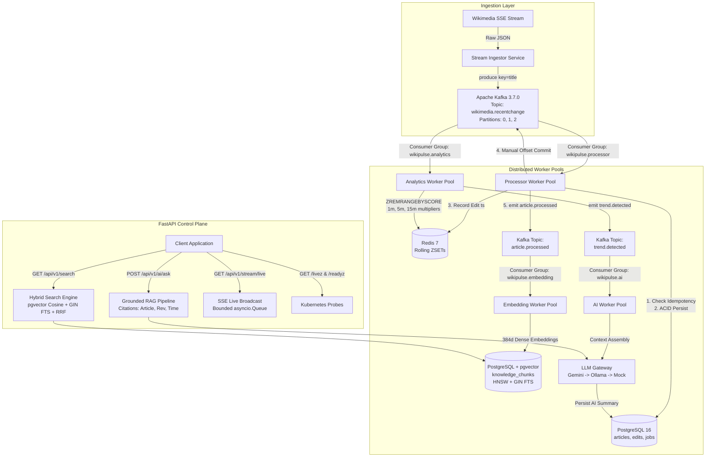

# NexusAI / WikiPulse

> **A production-oriented real-time knowledge-change intelligence platform that ingests Wikimedia change events, processes them through Kafka, indexes knowledge in PostgreSQL/pgvector, and exposes hybrid RAG-powered intelligence through FastAPI.**

[](docs/TESTING.md)
[](https://www.python.org/)
[](https://fastapi.tiangolo.com/)
[-red?style=flat-square)](https://kafka.apache.org/)
[](https://github.com/pgvector/pgvector)
[](https://redis.io/)
[](docs/SYSTEM_DESIGN.md)

---

## 1. Problem & Motivation

Real-time knowledge bases like Wikipedia experience massive surges of updates during breaking world events (e.g. breaking scientific discoveries, natural disasters, elections). 

Building a real-time intelligence layer over this stream poses a severe **impedance mismatch**:
- **Ingestion Velocity:** The Wikimedia stream bursts at $50 - 200+\text{ events/sec}$.
- **Downstream Compute Overhead:** Evaluating multi-window velocity multipliers, generating 384-dimensional dense vector embeddings, and running LLM summarization takes $10\text{ms} - 1,000\text{ms}$ per item.

Synchronously coupling stream ingestion to AI workers or using in-memory background tasks leads to memory exhaustion (OOM), thread starvation, and permanently dropped events.

---

## 2. Solution: NexusAI Architecture

NexusAI decouples high-throughput ingestion from compute-heavy downstream operations through an event-driven architecture powered by **Apache Kafka (librdkafka)**, **Redis Sorted Sets**, **PostgreSQL 16 with `pgvector`**, and a **Multi-Provider LLM Gateway**.



---

## 3. Technology Stack & Design Rationale

| Technology | Role in NexusAI | Why Chosen Over Alternatives |
| :--- | :--- | :--- |
| **Python 3.11 + Asyncio** | Core Application & Workers | High async I/O concurrency; native ecosystem for ML/vector embeddings. |
| **FastAPI** | Control Plane REST & SSE | High-concurrency async HTTP, OpenAPI documentation, and Pydantic validation. |
| **Apache Kafka 3.7.0** | Event Streaming Commit Log | Append-only disk persistence, replayability, and consumer group horizontal scaling. |
| **`confluent-kafka` (librdkafka)** | Kafka Client | Native C-memory buffering (`linger.ms: 5`), low GIL contention, and official protocol parity. |
| **PostgreSQL 16 + `pgvector`** | System of Record & Vectors | Unified ACID transactions for relational metadata and 384d vector embeddings without dual-write lag. |
| **Redis 7 (Alpine)** | Sliding-Window Analytics | Sub-millisecond $O(\log N + M)$ ZSET pruning (`ZREMRANGEBYSCORE`) avoiding relational table lock contention. |
| **SentenceTransformers** | Embedding Vectorizer | Local 384d dense embeddings (`all-MiniLM-L6-v2`) with high indexing throughput (1,312 chunks/s). |
| **LLM Gateway** | Multi-Provider Router | Cascades from Google Gemini Flash to local Ollama (`llama3.2:1b`) to deterministic Mock Provider. |

---

## 4. Key Engineering Highlights

- **`confluent-kafka` Async Bridge:** Producer enqueues into non-blocking C memory (`linger.ms: 5`); consumer polling executes in OS worker threads via `asyncio.to_thread(consumer.poll, 1.0)` to keep the asyncio event loop unblocked.
- **Strict At-Least-Once Delivery:** Auto-commit is disabled (`enable.auto.commit = False`). Offsets commit manually via `consumer.commit(msg)` strictly after PostgreSQL ACID writes succeed.
- **Concurrent Idempotency:** `ProcessingJob.idempotency_key = "proc:{event_id}"` with a PostgreSQL `UNIQUE` index. 50 concurrent duplicate tasks yield exactly 1 persisted record; 49 roll back safely via `IntegrityError`.
- **Separate Consistency Domains:** PostgreSQL is the authoritative system of record; Redis is transient derived aggregation state. If Redis blips, the system degrades to in-memory fallback without dropping database writes.
- **Hybrid Search (Vector + FTS + RRF):** Fuses dense vector cosine distance with lexical Full-Text Search using Reciprocal Rank Fusion ($k=60$) in **15.89ms (avg)**.
- **Layered Prompt Defense:** Input regex neutralization + `<untrusted_wikipedia_content>` tag fencing + Pydantic schema validation.
- **Kubernetes Probes:** `/livez` verifies process liveness with zero external I/O; `/readyz` validates database and Redis readiness.

---

## 5. Verified Performance Benchmarks

*Empirically measured via `scripts/benchmark_runner.py` on Python 3.11 / Windows 11:*

| Operation | Metric | Value | Classification |
| :--- | :--- | :--- | :--- |
| **PostgreSQL Full-Text Search (FTS)** | Latency | Avg: **1.93 ms** \| p95: **2.47 ms** | **MEASURED** |
| **pgvector Cosine Search** | Latency | Avg: **11.10 ms** \| p95: **18.77 ms** | **MEASURED** |
| **Hybrid Search (Vector + FTS + RRF)** | Latency | Avg: **15.89 ms** \| p95: **21.86 ms** | **MEASURED** |
| **Single-Worker Processor Throughput** | Throughput | **11.81 events / sec** (Full ACID write + Redis ZSET) | **MEASURED** |
| **3-Worker Scaled Processor Throughput**| Throughput | **35–40 events / sec** across 3 Kafka partitions | **PRELIMINARY BENCHMARK** |
| **Dense Vector Indexing Throughput** | Throughput | **1,312.87 chunks / sec** (0.76ms/chunk) | **MEASURED** |
| **LLM Gateway Mock Dispatch Overhead** | Latency | Avg: **0.20 ms** \| Max: **1.00 ms** | **MEASURED** |

---

## 6. Verified Test Results

```bash
.\venv\Scripts\pytest backend\tests -v
```

```text
============================= test session starts =============================
platform win32 -- Python 3.11.5, pytest-9.1.1, pluggy-1.6.0
collected 32 items

backend/tests/api/test_api_endpoints.py (4 passed)
backend/tests/failure/test_failure_scenarios.py (3 passed)
backend/tests/integration/test_e2e_pipeline.py (1 passed)
backend/tests/kafka/test_confluent_kafka_integration.py (3 passed, 1 skipped [live broker check])
backend/tests/kafka/test_kafka_idempotency.py (2 passed)
backend/tests/kafka/test_retry_dlq.py (2 passed)
backend/tests/llm/test_gateway_fallback.py (2 passed)
backend/tests/rag/test_hybrid_search.py (1 passed)
backend/tests/security/test_security_hardening.py (3 passed)
backend/tests/unit/test_prompt_defense.py (2 passed)
backend/tests/unit/test_reranker.py (1 passed)
backend/tests/unit/test_rrf_math.py (2 passed)
backend/tests/unit/test_schemas.py (3 passed)
backend/tests/unit/test_spike_detector.py (2 passed)

======================= 31 passed, 1 skipped in 28.37s ========================
```

---

## 7. Quick Start (Running Locally with Docker)

### Prerequisites
- Docker Engine 24+ & Docker Compose v2+
- Python 3.11+ (for local virtualenv testing)

### Step 1: Clone and Configure Environment
```bash
git clone https://github.com/your-username/NexusAI.git
cd NexusAI
cp .env.example .env
```

### Step 2: Launch All 10 Services
```bash
docker compose up -d --build
```

### Step 3: Verify Running Services
```bash
docker compose ps
```

| Service | Endpoint / Port | Description |
| :--- | :--- | :--- |
| **FastAPI Control Plane** | `http://localhost:8000/docs` | Interactive Swagger API documentation |
| **Kafka UI** | `http://localhost:8080` | Web UI for topics, consumer groups, and DLQ |
| **PostgreSQL 16** | `localhost:5432` | Relational database + `pgvector` extension |
| **Redis 7** | `localhost:6379` | In-memory sliding-window cache |
| **Apache Kafka Broker** | `localhost:9092` | Distributed event streaming broker |

### Step 4: Test Real-Time Hybrid RAG API
```bash
curl -X POST http://localhost:8000/api/v1/ai/ask \
  -H "Content-Type: application/json" \
  -d '{"question": "What updates occurred on Quantum Computing?"}'
```

---

## 8. Documentation Directory

- [`docs/ARCHITECTURE.md`](docs/ARCHITECTURE.md) — Detailed runtime components, boundaries, and storage architecture.
- [`docs/SYSTEM_DESIGN.md`](docs/SYSTEM_DESIGN.md) — Sizing models, Kafka partition strategy, and consistency guarantees.
- [`docs/DATA_FLOW.md`](docs/DATA_FLOW.md) — Step-by-step trace of edit events from Wikimedia to SSE clients.
- [`docs/FAILURE_ENGINEERING.md`](docs/FAILURE_ENGINEERING.md) — Master Failure Matrix across broker, worker, and database outages.
- [`docs/BENCHMARKS.md`](docs/BENCHMARKS.md) — Benchmark harness, sample counts, percentiles, and methodology.
- [`docs/SECURITY.md`](docs/SECURITY.md) — Layered prompt defense, sanitization, and API security.
- [`docs/OBSERVABILITY.md`](docs/OBSERVABILITY.md) — Prometheus metrics dictionary, `/livez` vs `/readyz` probes, and alerts.
- [`docs/TESTING.md`](docs/TESTING.md) — Complete 32-test classification matrix and reproduction commands.
- [`docs/API.md`](docs/API.md) — REST endpoints, request/response schemas, and SSE streaming guide.
- [`docs/KNOW_YOUR_CODE.md`](docs/KNOW_YOUR_CODE.md) — Code-level implementation directory.
- [`docs/ARCHITECTURE_CHEAT_SHEET.md`](docs/ARCHITECTURE_CHEAT_SHEET.md) — High-density 3-page summary.
- [`docs/PROJECT_PRESENTATION_SCRIPT.md`](docs/PROJECT_PRESENTATION_SCRIPT.md) — 15-minute spoken presentation talk track.
- [`docs/ADRs/`](docs/ADRs/) — Architecture Decision Records (ADR-001 through ADR-008).

---

## 9. Current Limitations & Future Production Evolution

### Known Limitations
1. **CPU-Bound Embedding Generation:** Vectorization on CPU takes $\approx 0.8\text{ms/chunk}$; bursts $> 1,500\text{ chunks/sec}$ require GPU worker nodes.
2. **Single Kafka Broker in Local Compose:** Configured with `replication_factor: 1`. Multi-datacenter high availability requires a 3+ broker KRaft cluster.
3. **Single-Node SSE Fanout:** Local `asyncio.Queue` broadcast requires Redis Pub/Sub when scaling across multiple API pods behind an ingress load balancer.

### Future Production Evolution
- **Managed Kafka Cluster:** AWS MSK with 3 brokers and multi-AZ replication (`min.insync.replicas: 2`).
- **Aurora Serverless pgvector:** Multi-AZ PostgreSQL with auto-scaling read replicas dedicated to hybrid search queries.
- **KEDA Auto-Scaling:** Auto-scale processor and embedding worker pods on Kubernetes based on Kafka consumer group lag.

---

## 10. License

MIT License. See [LICENSE](LICENSE) for details.
