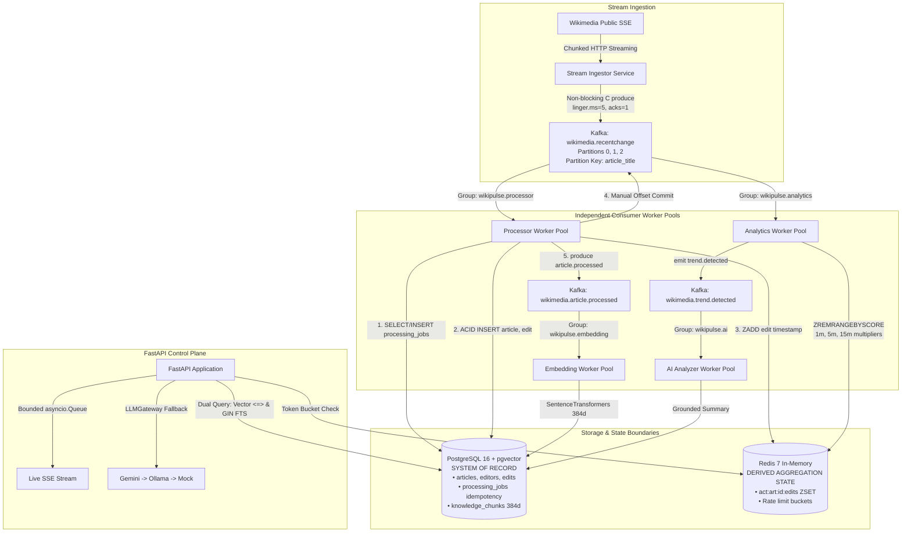

# NexusAI / WikiPulse — Architectural Design & Runtime Components

## 1. Executive Summary

NexusAI is an event-driven distributed platform designed to process real-time knowledge change streams, evaluate multi-window velocity multipliers, generate dense semantic vector embeddings, and serve evidence-grounded AI queries with verified citation attribution.

---

## 2. Component Topology & Communication Patterns

---

## 3. Data Store Boundaries & Consistency Domains

### 3.1 PostgreSQL (Authoritative System of Record)
- Stores canonical relational entities (`articles`, `editors`, `edits`) and knowledge chunks with 384-dimensional vector embeddings.
- Guarantees durability via Write-Ahead Logging (WAL) and ACID transactional boundaries.
- Maintains the `processing_jobs` table with a `UNIQUE` index on `idempotency_key = "proc:{event_id}"` to ensure idempotent deduplication under message replays.

### 3.2 Redis (Transient Derived Aggregation State)
- Maintains in-memory Sorted Sets (`ZSET`) of edit timestamps (`act:art:{id}:edits`) for rolling 1m, 5m, and 15m velocity multipliers.
- Prunes expired timestamps via `ZREMRANGEBYSCORE` in $< 0.5\text{ms}$ ($O(\log N + M)$), avoiding heavy database table locks.
- **Consistency Separation:** PostgreSQL and Redis operate in **separate consistency domains**. If Redis is unavailable, `ActivityCounterService` degrades gracefully to an in-memory cache without aborting primary PostgreSQL transactions.

---

## 4. Confluent Kafka (librdkafka) Async Bridge

`confluent-kafka` is a synchronous C-extension client. To prevent blocking the Python asyncio reactor:
1. **Producer:** `producer.produce()` appends messages to librdkafka's C-memory queue non-blockingly (~1µs). `producer.poll(0)` dispatches completed delivery callbacks on loop ticks.
2. **Consumer:** `consumer.poll()` executes in dedicated OS worker threads via `await asyncio.to_thread(consumer.poll, 1.0)`, releasing the Python GIL during network I/O.
3. **Manual Offset Commits:** `enable.auto.commit = False`. Offsets are committed via `await asyncio.to_thread(consumer.commit, msg)` strictly after PostgreSQL transactions succeed.
