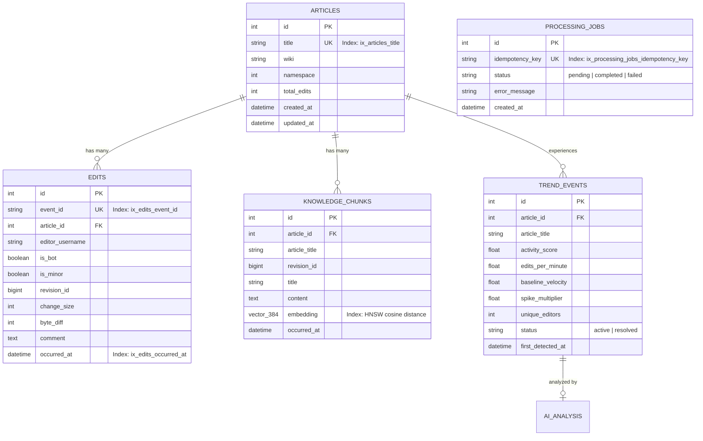
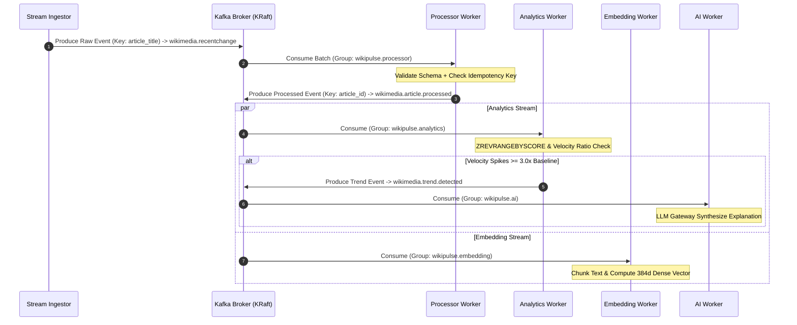
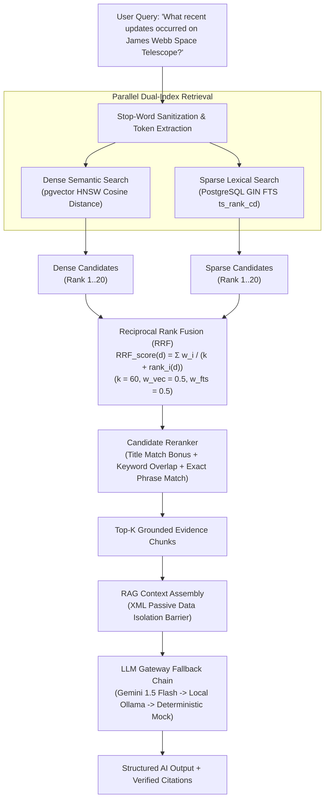

# NexusAI / WikiPulse — Verified System Architecture

This document defines the **executable, verified architecture** of NexusAI (WikiPulse) based strictly on source code, runtime configuration, Docker Compose topology, and automated test validation.

---

## 1. High-Level Architecture Overview

NexusAI is a **real-time knowledge intelligence and event-driven analytics platform** that ingests continuous Wikipedia edit streams, detects velocity spikes, indexes unstructured content into a hybrid vector/lexical store, and serves grounded RAG intelligence.

```mermaid
flowchart TB
    subgraph Ingestion ["1. Stream Ingestion Layer"]
        SSE_Source["Wikimedia EventStreams (SSE) / Synthetic Generator"] --> Ingestor["wikipulse-stream-ingestor"]
        Ingestor -->|Produce JSON| Topic_Raw["Topic: wikimedia.recentchange"]
    end

    subgraph KafkaBroker ["2. Apache Kafka 3.7 (Storage & Queuing)"]
        Topic_Raw
        Topic_Proc["Topic: wikimedia.article.processed"]
        Topic_Trend["Topic: wikimedia.trend.detected"]
        Topic_DLQ["Topic: wikimedia.dlq"]
    end

    subgraph Workers ["3. Distributed Asynchronous Worker Pools"]
        ProcWorker["nexusai-processor-worker-1"]
        AnalyticsWorker["nexusai-analytics-worker-1"]
        EmbedWorker["nexusai-embedding-worker-1"]
        AIWorker["nexusai-ai-worker-1"]
    end

    subgraph StorageLayer ["4. Persistence & State Layer"]
        Postgres[("PostgreSQL 16 + pgvector\n(Articles, Edits, KnowledgeChunks, Trends, AIAnalysis)")]
        Redis[("Redis 7 In-Memory\n(Sliding Window ZSETs, Locks, Rate Limiting)")]
    end

    subgraph APILayer ["5. Control Plane & FastAPI Backend (wikipulse-api)"]
        FastAPI["FastAPI ASGI App\n(:8000)"]
        SearchEngine["Hybrid Search Service\n(pgvector HNSW + GIN FTS + RRF)"]
        LLMGateway["LLM Gateway\n(Gemini -> Ollama -> Mock)"]
        SSEBroadcaster["SSE Broadcaster\n(/api/v1/stream/live)"]
    end

    subgraph Clients ["6. External Ingress & Clients"]
        BrowserClient["Browser / REST Client"]
    end

    %% Ingestion to Kafka
    Topic_Raw -->|Consume (Group: wikipulse.processor)| ProcWorker
    ProcWorker -->|Write Relational & Idempotency| Postgres
    ProcWorker -->|ZADD Sliding Windows| Redis
    ProcWorker -->|Produce| Topic_Proc
    ProcWorker -.->|Poison Pill Errors| Topic_DLQ

    Topic_Proc -->|Consume (Group: wikipulse.analytics)| AnalyticsWorker
    AnalyticsWorker -->|ZREVRANGEBYSCORE Velocity| Redis
    AnalyticsWorker -->|Insert Trend Record| Postgres
    AnalyticsWorker -->|Produce Spike| Topic_Trend

    Topic_Proc -->|Consume (Group: wikipulse.embedding)| EmbedWorker
    EmbedWorker -->|Compute 384d Dense Vector| Postgres

    Topic_Trend -->|Consume (Group: wikipulse.ai)| AIWorker
    AIWorker -->|Synthesize Explanation| LLMGateway
    AIWorker -->|Update ai_summary| Postgres

    %% API Ingress
    BrowserClient -->|HTTP REST / SSE| FastAPI
    FastAPI -->|Query| Postgres
    FastAPI -->|Query Cache / Metrics| Redis
    FastAPI --> SearchEngine
    SearchEngine --> Postgres
    FastAPI --> LLMGateway
    FastAPI --> SSEBroadcaster
    SSEBroadcaster -->|Live Events Push| BrowserClient
```

---

## 2. Multi-Container Docker Topology

The production runtime is orchestrated via [`docker-compose.yml`](file:///d:/NexusAI/docker-compose.yml) comprising 10 distinct containers:

| Service Name | Container Name | Base Image / Dockerfile | Exposed Ports | Primary Responsibility |
| :--- | :--- | :--- | :--- | :--- |
| **`postgres`** | `wikipulse-postgres` | `pgvector/pgvector:pg16` | `5432:5432` | Relational persistence, vector embeddings, GIN FTS. |
| **`redis`** | `wikipulse-redis` | `redis:7-alpine` | `6379:6379` | Rolling sliding-window ZSETs, distributed locks, counter cache. |
| **`kafka`** | `wikipulse-kafka` | `apache/kafka:3.7.0` | `9092:9092` | Distributed KRaft message broker (3 partitions/topic). |
| **`kafka-ui`** | `wikipulse-kafka-ui` | `provectuslabs/kafka-ui:latest` | `8080:8080` | Web UI for inspecting Kafka topics, consumer lag, and offsets. |
| **`api`** | `wikipulse-api` | `backend/Dockerfile` | `8000:8000` | FastAPI application, hybrid search engine, and SSE stream server. |
| **`stream-ingestor`** | `wikipulse-stream-ingestor` | `workers/stream_ingestor/Dockerfile` | None | Ingests Wikimedia SSE stream or generates realistic synthetic edits. |
| **`processor-worker`** | `nexusai-processor-worker-1` | `workers/processor/Dockerfile` | None | Normalizes edits, updates Redis sliding windows, writes DB. |
| **`analytics-worker`** | `nexusai-analytics-worker-1` | `workers/analytics/Dockerfile` | None | Detects velocity deviations $\ge 3.0\times$ over 15-minute baselines. |
| **`embedding-worker`** | `nexusai-embedding-worker-1` | `workers/embedding/Dockerfile` | None | Chunks revision text and computes 384-dimensional vector embeddings. |
| **`ai-worker`** | `nexusai-ai-worker-1` | `workers/ai/Dockerfile` | None | Asynchronously synthesizes explanations for detected activity spikes. |

---

## 3. Storage & Schema Design

### A. PostgreSQL Relational Models & Indexes
Defined in [`backend/app/models/`](file:///d:/NexusAI/backend/app/models/):



### B. Redis Key Design & Data Structures
Defined in [`backend/app/redis/`](file:///d:/NexusAI/backend/app/redis/):

| Key Pattern | Data Structure | Purpose | TTL |
| :--- | :--- | :--- | :--- |
| `act:art:{article_id}:edits` | **Sorted Set (ZSET)** | Member: `event_id`, Score: `epoch_timestamp`. Used for counting edits in rolling 1-min, 5-min, and 15-min windows. | 3600s (1 hour) |
| `act:art:{article_id}:editors` | **Sorted Set (ZSET)** | Member: `username`, Score: `epoch_timestamp`. Used for tracking unique active editors. | 3600s (1 hour) |
| `act:art:{article_id}:bytes` | **Sorted Set (ZSET)** | Member: `{event_id}:{byte_diff}`, Score: `epoch_timestamp`. Used for tracking net byte volume churn. | 3600s (1 hour) |
| `cache:metrics:global` | **String (JSON)** | Cached global KPIs (processed count, rate, hit ratio) for dashboard polling. | 3 seconds |
| `lock:trend:{article_id}` | **String (SET NX EX)** | Distributed mutex preventing duplicate trend alerts during rapid edit bursts. | 60 seconds |

---

## 4. Apache Kafka Message Bus Contracts

Defined in [`backend/app/kafka/`](file:///d:/NexusAI/backend/app/kafka/):



---

## 5. Hybrid Search & RAG Intelligence Engine

Defined in [`backend/app/search/`](file:///d:/NexusAI/backend/app/search/) and [`backend/app/rag/`](file:///d:/NexusAI/backend/app/rag/):


