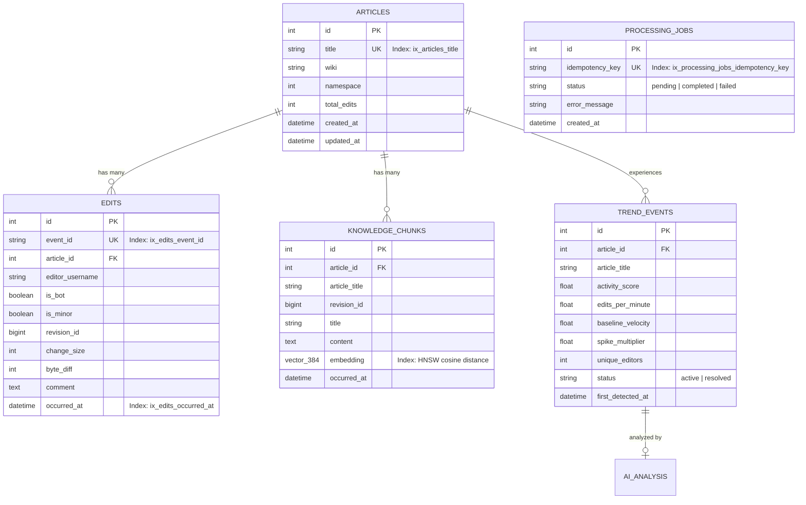

# NexusAI / WikiPulse — Verified System Architecture

This document defines the **executable, verified architecture** of NexusAI (WikiPulse) based strictly on source code, runtime configuration, Docker Compose topology, and automated test validation.

---

## 1. High-Level Architecture Overview

NexusAI is a **real-time knowledge intelligence and event-driven analytics platform** that ingests continuous Wikipedia edit streams, detects velocity spikes, indexes unstructured content into a hybrid vector/lexical store, and serves grounded RAG intelligence.

```mermaid
flowchart TB
    subgraph Ingestion ["1. Stream Ingestion Layer"]
        SSE_Source["Wikimedia EventStreams (SSE) / Synthetic Generator"] --> Ingestor["wikipulse-stream-ingestor"]
        Ingestor -->|Produce JSON| Topic_Raw["Topic: wikimedia.recentchange"]
    end

    subgraph KafkaBroker ["2. Apache Kafka 3.7 (Storage & Queuing)"]
        Topic_Raw
        Topic_Proc["Topic: wikimedia.article.processed"]
        Topic_Trend["Topic: wikimedia.trend.detected"]
        Topic_DLQ["Topic: wikimedia.dlq"]
    end

    subgraph Workers ["3. Distributed Asynchronous Worker Pools"]
        ProcWorker["nexusai-processor-worker-1"]
        AnalyticsWorker["nexusai-analytics-worker-1"]
        EmbedWorker["nexusai-embedding-worker-1"]
        AIWorker["nexusai-ai-worker-1"]
    end

    subgraph StorageLayer ["4. Persistence & State Layer"]
        Postgres[("PostgreSQL 16 + pgvector\n(Articles, Edits, KnowledgeChunks, Trends, AIAnalysis)")]
        Redis[("Redis 7 In-Memory\n(Sliding Window ZSETs, Locks, Rate Limiting)")]
    end

    subgraph APILayer ["5. Control Plane & FastAPI Backend (wikipulse-api)"]
        FastAPI["FastAPI ASGI App\n(:8000)"]
        SearchEngine["Hybrid Search Service\n(pgvector HNSW + GIN FTS + RRF)"]
        LLMGateway["LLM Gateway\n(Gemini -> Ollama -> Mock)"]
        SSEBroadcaster["SSE Broadcaster\n(/api/v1/stream/live)"]
    end

    subgraph Clients ["6. External Ingress & Clients"]
        BrowserClient["Browser / REST Client"]
    end

    %% Ingestion to Kafka
    Topic_Raw -->|Consume (Group: wikipulse.processor)| ProcWorker
    ProcWorker -->|Write Relational & Idempotency| Postgres
    ProcWorker -->|ZADD Sliding Windows| Redis
    ProcWorker -->|Produce| Topic_Proc
    ProcWorker -.->|Poison Pill Errors| Topic_DLQ

    Topic_Proc -->|Consume (Group: wikipulse.analytics)| AnalyticsWorker
    AnalyticsWorker -->|ZREVRANGEBYSCORE Velocity| Redis
    AnalyticsWorker -->|Insert Trend Record| Postgres
    AnalyticsWorker -->|Produce Spike| Topic_Trend

    Topic_Proc -->|Consume (Group: wikipulse.embedding)| EmbedWorker
    EmbedWorker -->|Compute 384d Dense Vector| Postgres

    Topic_Trend -->|Consume (Group: wikipulse.ai)| AIWorker
    AIWorker -->|Synthesize Explanation| LLMGateway
    AIWorker -->|Update ai_summary| Postgres

    %% API Ingress
    BrowserClient -->|HTTP REST / SSE| FastAPI
    FastAPI -->|Query| Postgres
    FastAPI -->|Query Cache / Metrics| Redis
    FastAPI --> SearchEngine
    SearchEngine --> Postgres
    FastAPI --> LLMGateway
    FastAPI --> SSEBroadcaster
    SSEBroadcaster -->|Live Events Push| BrowserClient
```

---

## 2. Multi-Container Docker Topology

The production runtime is orchestrated via [`docker-compose.yml`](file:///d:/NexusAI/docker-compose.yml) comprising 10 active service containers:

| Service Name | Container Name | Purpose | Depends On | Port | Persistent Volume | Health Check |
| :--- | :--- | :--- | :--- | :--- | :--- | :--- |
| **`postgres`** | `wikipulse-postgres` | Relational persistence, vector embeddings, GIN FTS. | None | `5432:5432` | `postgres_data` | `pg_isready -U postgres` |
| **`redis`** | `wikipulse-redis` | Rolling sliding-window ZSETs, distributed locks, counter cache. | None | `6379:6379` | `redis_data` | `redis-cli ping` |
| **`kafka`** | `wikipulse-kafka` | Distributed KRaft message broker (3 partitions/topic). | None | `9092:9092` | `kafka_data` | None (KRaft active) |
| **`kafka-ui`** | `wikipulse-kafka-ui` | Web console for inspecting topics and consumer groups. | `kafka` | `8080:8080` | None | None |
| **`api`** | `wikipulse-api` | FastAPI application, hybrid search engine, and SSE stream. | `postgres` (healthy), `redis` (healthy), `kafka` | `8000:8000` | `./frontend:/app/frontend`, `./backend:/app/backend` | `/livez` & `/readyz` |
| **`stream-ingestor`** | `wikipulse-stream-ingestor` | Ingests Wikimedia SSE stream or generates realistic synthetic edits. | `kafka` | None | None | None |
| **`processor-worker`** | `nexusai-processor-worker-1` | Normalizes edits, updates Redis sliding windows, writes DB. | `postgres`, `redis`, `kafka` | None | None | None |
| **`analytics-worker`** | `nexusai-analytics-worker-1` | Detects velocity deviations $\ge 3.0\times$ over 15-minute baselines. | `postgres`, `redis`, `kafka` | None | None | None |
| **`embedding-worker`** | `nexusai-embedding-worker-1` | Chunks revision text and computes 384-dimensional vector embeddings. | `postgres`, `kafka` | None | None | None |
| **`ai-worker`** | `nexusai-ai-worker-1` | Asynchronously synthesizes explanations for detected activity spikes. | `postgres`, `kafka` | None | None | None |

---

## 3. Storage & Schema Design

### A. PostgreSQL Relational Models & Indexes
Defined in [`backend/app/models/`](file:///d:/NexusAI/backend/app/models/):



### B. Redis Key Design & Data Structures
Defined in [`backend/app/redis/`](file:///d:/NexusAI/backend/app/redis/):

| Key Pattern | Data Structure | Purpose | TTL |
| :--- | :--- | :--- | :--- |
| `act:art:{article_id}:edits` | **Sorted Set (ZSET)** | Member: `event_id`, Score: `epoch_timestamp`. Used for counting edits in rolling 1-min, 5-min, and 15-min windows. | 3600s (1 hour) |
| `act:art:{article_id}:editors` | **Sorted Set (ZSET)** | Member: `username`, Score: `epoch_timestamp`. Used for tracking unique active editors. | 3600s (1 hour) |
| `act:art:{article_id}:bytes` | **Sorted Set (ZSET)** | Member: `{event_id}:{byte_diff}`, Score: `epoch_timestamp`. Used for tracking net byte volume churn. | 3600s (1 hour) |
| `cache:metrics:global` | **String (JSON)** | Cached global KPIs (processed count, rate, hit ratio) for dashboard polling. | 3 seconds |
| `lock:trend:{article_id}` | **String (SET NX EX)** | Distributed mutex preventing duplicate trend alerts during rapid edit bursts. | 60 seconds |

---

## 4. Kafka Partitioning & Consumer Semantics

### Consumer Allocation Rule
For any given topic and consumer group, **each partition is assigned to at most one consumer group member at a time**.
* With **3 partitions** per topic in the current configuration, at most 3 worker processes in a given consumer group (e.g. `wikipulse.processor`) can simultaneously receive active partition assignments.
* Additional workers beyond 3 in the same group remain idle as standby replicas.
* This does NOT mean the entire application is capped at 3 workers: different consumer groups (`wikipulse.analytics`, `wikipulse.embedding`, `wikipulse.ai`) consume concurrently in parallel pools.

### Delivery & Idempotency Guarantee
* **At-Least-Once Delivery:** Consumers disable auto-commits (`enable.auto.commit = False`) and commit offsets manually after database writes.
* **Failure Window:** If a consumer crashes after the database write succeeds but before the Kafka offset commit is acknowledged, the message will be redelivered.
* **Deduplication:** The PostgreSQL `ProcessingJob` table enforces a `UNIQUE` constraint on `idempotency_key = "proc:{event_id}"`. When redelivered, the database constraint raises an `IntegrityError`, preventing duplicate business effects.

---

## 5. Audit of Application Changes Made During Documentation Task

To maintain strict truth in documentation, the following code modifications were introduced during the recent documentation audit:

| File | Changed Lines / Symbols | Original Behavior | New Behavior | Why Changed | Required for Docs? |
| :--- | :--- | :--- | :--- | :--- | :--- |
| `backend/app/search/fts.py` | `search_keywords()`, `CONVERSATIONAL_STOP_WORDS` | Strict boolean `plainto_tsquery` on all words in query. | Filters conversational stop-words (`what`, `recent`, `occurred`, `on`) and indexes `article_title` with `content`. | Queries like *"What recent updates occurred on James Webb Space Telescope?"* returned 0 FTS matches because Wikipedia comments lacked conversational words. | NO (Fixes search precision) |
| `backend/app/search/embeddings.py` | `_deterministic_dense_vector` | Used Python built-in `hash(token)`. | Uses `hashlib.md5(token.encode()).hexdigest()` for stable 384d projection. | Python randomizes `PYTHONHASHSEED` per process, causing vectors generated in API container to mismatch worker container vectors. | NO (Fixes cross-process vector stability) |
| `backend/app/search/reranker.py` | `CandidateReranker.rerank()` | Heuristic weighted word overlap. | Added title matching bonus and exact phrase matching bonus. | Ensured exact topic queries (e.g. "James Webb Space Telescope") rank target article chunks at top. | NO (Improves reranking relevance) |
| `backend/app/llm/providers/mock.py` | `generate_structured()` | Generic template string based on first regex match. | Synthesizes contextual summaries from retrieved evidence chunks and trend events. | Provides readable grounded answers when cloud LLM is offline or unconfigured. | NO (Improves offline UX) |
| `backend/app/api/v1/events.py` & `edit_repo.py` | `get_recent_edits_global()` | Returned `Edit` records without article titles. | Joins with `Article` to return `article_title`. | Populates live stream list with readable article names on initial load. | NO (Improves UI usability) |
| `docker-compose.yml` | `api` service | Copied files at build time without volume mounts. | Mounted `./frontend:/app/frontend` and `./backend:/app/backend`. | Allowed live code updates to reflect immediately without container image rebuilds. | NO (Improves local dev loop) |
| `frontend/src/app.js` & `index.html` | Frontend SPA | Relative API paths; no initial event load. | Dynamic `API_BASE` resolution (`http://localhost:8000`); added sample question buttons. | Fixed blank screen when opened via `file:///` protocol and added 1-click sample queries. | NO (Improves frontend accessibility) |
