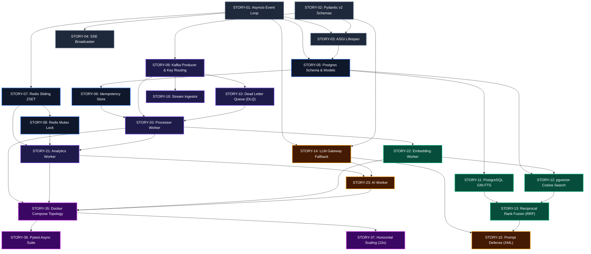

# NexusAI Backend Engineering Dependency Graph

This document provides a **Mermaid Directed Acyclic Graph (DAG)** mapping prerequisite dependencies across all backend stories.

```mermaid
graph TD
    classDef foundation fill:#1e293b,stroke:#64748b,stroke-width:2px,color:#fff;
    classDef persistence fill:#0f172a,stroke:#3b82f6,stroke-width:2px,color:#fff;
    classDef streaming fill:#1e1b4b,stroke:#8b5cf6,stroke-width:2px,color:#fff;
    classDef search fill:#064e3b,stroke:#10b981,stroke-width:2px,color:#fff;
    classDef ai fill:#451a03,stroke:#f59e0b,stroke-width:2px,color:#fff;
    classDef system fill:#3b0764,stroke:#d946ef,stroke-width:2px,color:#fff;

    %% Module 1: Foundations
    S01["STORY-01: Asyncio Event Loop"]:::foundation
    S02["STORY-02: Pydantic v2 Schemas"]:::foundation
    S03["STORY-03: ASGI Lifespan"]:::foundation
    S04["STORY-04: SSE Broadcaster"]:::foundation

    S01 --> S03
    S01 --> S04
    S02 --> S03

    %% Module 2: Persistence & Redis
    S05["STORY-05: Postgres Schema & Models"]:::persistence
    S06["STORY-06: Idempotency Store"]:::persistence
    S07["STORY-07: Redis Sliding ZSET"]:::persistence
    S08["STORY-08: Redis Mutex Lock"]:::persistence

    S01 --> S05
    S03 --> S05
    S05 --> S06
    S01 --> S07
    S07 --> S08

    %% Module 3: Kafka Streaming & Workers
    S09["STORY-09: Kafka Producer & Key Routing"]:::streaming
    S10["STORY-10: Dead Letter Queue (DLQ)"]:::streaming
    S19["STORY-19: Stream Ingestor"]:::streaming
    S20["STORY-20: Processor Worker"]:::streaming
    S21["STORY-21: Analytics Worker"]:::streaming

    S02 --> S09
    S09 --> S10
    S09 --> S19
    S06 --> S20
    S09 --> S20
    S10 --> S20
    S07 --> S21
    S08 --> S21
    S20 --> S21

    %% Module 4: Search & RAG
    S11["STORY-11: PostgreSQL GIN FTS"]:::search
    S12["STORY-12: pgvector Cosine Search"]:::search
    S13["STORY-13: Reciprocal Rank Fusion (RRF)"]:::search
    S22["STORY-22: Embedding Worker"]:::search

    S05 --> S11
    S05 --> S12
    S20 --> S22
    S22 --> S12
    S11 --> S13
    S12 --> S13

    %% Module 5: LLM Gateway & AI
    S14["STORY-14: LLM Gateway Fallback"]:::ai
    S15["STORY-15: Prompt Defense (XML)"]:::ai
    S23["STORY-23: AI Worker"]:::ai

    S01 --> S14
    S02 --> S14
    S14 --> S15
    S13 --> S15
    S21 --> S23
    S14 --> S23

    %% Module 6: System Design & Scaling
    S35["STORY-35: Docker Compose Topology"]:::system
    S36["STORY-36: Pytest Async Suite"]:::system
    S37["STORY-37: Horizontal Scaling (10x)"]:::system

    S20 --> S35
    S21 --> S35
    S22 --> S35
    S23 --> S35
    S35 --> S36
    S35 --> S37
```
