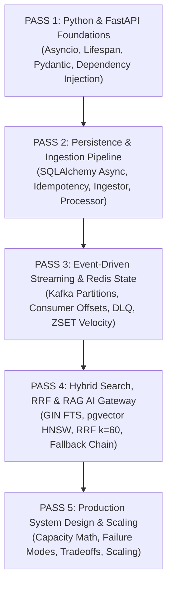
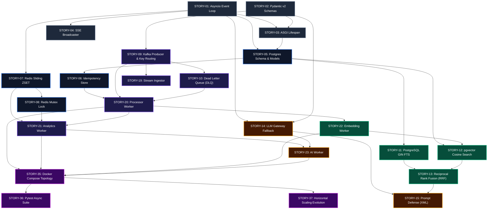

# NexusAI Backend Engineering Study Roadmap

This roadmap defines the **exact dependency-ordered study path and prerequisite DAG** across the NexusAI backend engineering stories.

---

## 1. The 5-Pass Study Methodology

---

## 2. Story Dependency Graph (DAG)

---

## 3. Detailed Pass Breakdown

### PASS 1: Python & FastAPI Foundations
* **Target Stories:** `STORY-01` to `STORY-04`
* **Key Files:** [`backend/app/main.py`](file:///d:/NexusAI/backend/app/main.py), [`backend/app/api/deps.py`](file:///d:/NexusAI/backend/app/api/deps.py), [`backend/app/schemas/event.py`](file:///d:/NexusAI/backend/app/schemas/event.py)
* **Mastery Criteria:** Master the single-threaded event loop, ASGI lifespan startup/shutdown, dependency injection rollback safety, and Pydantic v2 validation.

---

### PASS 2: Persistence & Ingestion Pipeline
* **Target Stories:** `STORY-05` to `STORY-06`, `STORY-19` to `STORY-20`
* **Key Files:** [`backend/app/db/session.py`](file:///d:/NexusAI/backend/app/db/session.py), [`backend/app/models/`](file:///d:/NexusAI/backend/app/models/), [`workers/processor/processor.py`](file:///d:/NexusAI/workers/processor/processor.py)
* **Mastery Criteria:** Master SQLAlchemy 2.0 `AsyncSession`, connection pool pre-pinging, and `ProcessingJob` database-level idempotency deduplication.

---

### PASS 3: Distributed Streaming & Redis State
* **Target Stories:** `STORY-07` to `STORY-10`, `STORY-21` to `STORY-23`
* **Key Files:** [`backend/app/kafka/`](file:///d:/NexusAI/backend/app/kafka/), [`backend/app/redis/client.py`](file:///d:/NexusAI/backend/app/redis/client.py), [`workers/analytics/analytics.py`](file:///d:/NexusAI/workers/analytics/analytics.py)
* **Mastery Criteria:** Trace Kafka partition keys (`article_title`), manual offset commit loops, poison pill Dead Letter Queue routing, and Redis ZSET rolling sliding windows.

---

### PASS 4: Hybrid Search, RRF & RAG AI Gateway
* **Target Stories:** `STORY-11` to `STORY-15`, `STORY-24` to `STORY-34`
* **Key Files:** [`backend/app/search/`](file:///d:/NexusAI/backend/app/search/), [`backend/app/rag/`](file:///d:/NexusAI/backend/app/rag/), [`backend/app/llm/gateway.py`](file:///d:/NexusAI/backend/app/llm/gateway.py)
* **Mastery Criteria:** Understand dual-index retrieval (pgvector + GIN FTS), Reciprocal Rank Fusion ($k=60$), candidate reranking, XML prompt isolation, and multi-provider LLM fallback cascades.

---

### PASS 5: System Design, Testing & Horizontal Scaling
* **Target Stories:** `STORY-35` to `STORY-40`
* **Key Files:** [`docker-compose.yml`](file:///d:/NexusAI/docker-compose.yml), [`docs/mastery/SYSTEM_DESIGN.md`](file:///d:/NexusAI/docs/mastery/SYSTEM_DESIGN.md)
* **Mastery Criteria:** Calculate storage growth and Kafka partition requirements ($W = \lceil R / C \rceil$), defend architectural tradeoffs, and articulate horizontal scaling paths.
