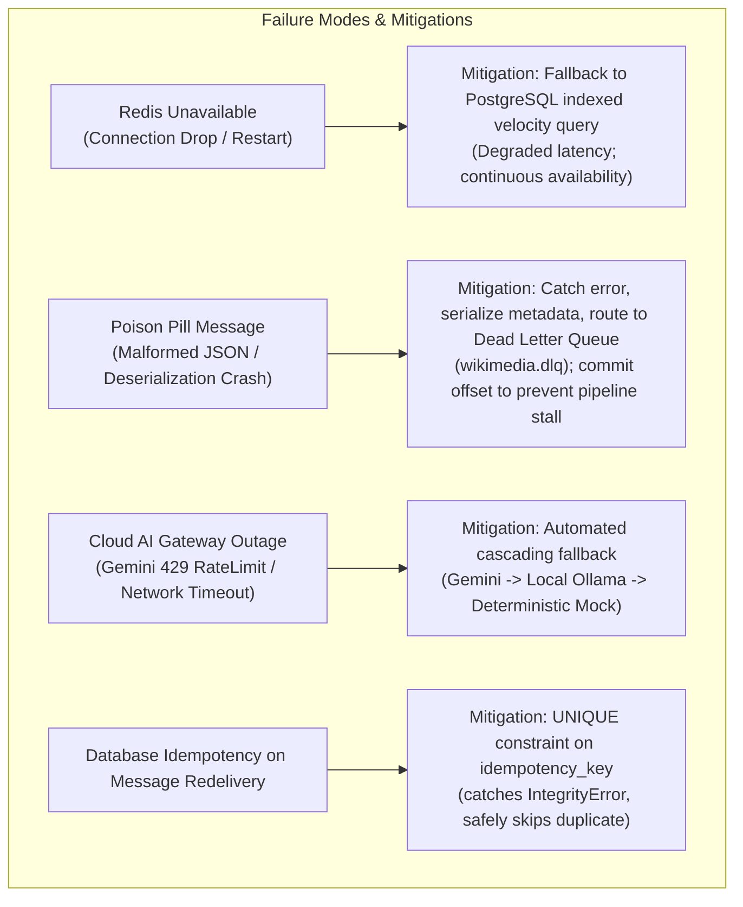

# NexusAI / WikiPulse — System Design & Scalability Analysis

This document provides the **system design specification, capacity planning models, failure mode analyses, and horizontal scaling roadmaps** for the NexusAI platform.

---

## 1. Requirements & Non-Functional Constraints

### Functional Capabilities
1. **Continuous Ingestion:** Ingest real-time Wikipedia revision streams via Wikimedia SSE or synthetic edit generators.
2. **Velocity Tracking:** Maintain rolling edit velocity counters per article over 1-minute, 5-minute, and 15-minute sliding windows in Redis.
3. **Automated Spike Detection:** Trigger trend alerts when an article's edit velocity exceeds $\ge 3.0\times$ its historical baseline with $> 3$ unique active editors.
4. **Hybrid Knowledge Retrieval:** Dual-index search combining pgvector semantic search and PostgreSQL GIN lexical search via Reciprocal Rank Fusion ($k=60$).
5. **Grounded AI Synthesis:** Synthesize factual change summaries with verified revision citations and XML prompt isolation defense.

### Non-Functional Latency & Resilience Targets

| Dimension | Target Profile | Architectural Mechanism |
| :--- | :--- | :--- |
| **API Read Latency** | Sub-50ms Hybrid Search (local) | Dual-index parallel query + in-memory RRF fusion ($k=60$). |
| **Ingestion Pipeline** | Asynchronous decoupled stream | Kafka broker decoupling + asynchronous batch workers. |
| **Spike Detection** | Real-time sliding window | Redis ZSET sorted sets + atomic pipelines. |
| **Availability** | Graceful degradation | Multi-provider fallback cascade (Gemini $\to$ Ollama $\to$ Mock). |
| **Delivery Guarantee** | At-Least-Once Delivery | Manual Kafka offset commits + PostgreSQL `ProcessingJob` idempotency. |

---

## 2. Capacity Planning & Quantitative Estimations (Model)

### A. Storage Sizing Model (Example Calculation)
* **Assumed Ingestion Rate:** $150\text{ events/sec}$ average.
* **Daily Event Count:** $150 \times 86,400 \approx 13.0\text{ Million edits/day}$.
* **Payload Estimations:**
  * Normalized PostgreSQL Row (`edits` table): $\sim 350\text{ Bytes}$
  * Knowledge Chunk with 384d Vector: $\sim 500\text{ Bytes (text)} + (384 \times 4\text{ Bytes}) \approx 2.0\text{ KB}$
* **Estimated Storage Growth:**
  $$\text{Storage/day} \approx 13.0\text{M} \times (350\text{B} + 2.0\text{KB}) \approx 30.5\text{ GB/day}$$
  * Retention Policy: Retain full revision text for a bounded window (e.g. 30 days), while preserving aggregated article statistics permanently.

---

### B. Redis In-Memory Working Set Estimation
* **Simultaneously Active Articles:** $\sim 25,000$ articles during peak hours.
* **Average Edits per Active Article (1-hour window):** $\sim 20$ edits.
* **ZSET Memory Overhead per Entry:** $\sim 64\text{ Bytes}$ (member string + 8-byte score).
* **Total Redis RAM Estimation:**
  $$\text{RAM} \approx 25,000 \times 20 \times 64\text{ Bytes} \times 3\text{ (edits, editors, bytes keys)} \approx 96.0\text{ MB}$$
  * Accounting for Redis dictionary overhead ($\sim 1.5\times$), the working set fits within $\mathbf{< 256\text{ MB}}$ RAM.

---

### C. Kafka Partition Sizing Model
To determine the number of Kafka partitions ($P$) and worker instances ($W$) required for a given target throughput ($R$):

$$W = \left\lceil \frac{R}{C_{\text{worker}}} \right\rceil$$

Where:
* $R$ is the peak incoming event rate.
* $C_{\text{worker}}$ is the measured processing throughput of a single worker instance (including database write and Redis pipeline).
* If $R = 1,000\text{ msg/sec}$ and $C_{\text{worker}} = 250\text{ msg/sec}$, then $W = \lceil 1000 / 250 \rceil = 4$ workers, requiring a topic with at least 4 partitions to allow 1-to-1 consumer assignment.

---

## 3. Failure Modes & Mitigations



---

## 4. Current vs. Future System Design Evolution

```text
┌────────────────────────────────────────────────────────────────────────────────────────────────────────┐
│ CURRENT ARCHITECTURE (Validated Single-Node Docker Compose Topology)                                  │
├────────────────────────────────────────────────────────────────────────────────────────────────────────┤
│ • Ingestion: Single Stream Ingestor process producing to wikimedia.recentchange                        │
│ • Kafka: Single-broker KRaft cluster (3 partitions per topic)                                         │
│ • Database: Single PostgreSQL 16 instance with pgvector extension                                     │
│ • Caching: Single Redis 7 instance with ZSET sliding windows                                           │
│ • Workers: 4 dedicated async worker processes (processor, analytics, embedding, ai)                    │
└────────────────────────────────────────────────────────────────────────────────────────────────────────┘
                                    │
                                    │ Conditional Evolution Trigger (Under Higher Traffic Load)
                                    ▼
┌────────────────────────────────────────────────────────────────────────────────────────────────────────┐
│ [FUTURE] DISTRIBUTED HORIZONTAL SCALING (Not Implemented in Current Codebase)                          │
├────────────────────────────────────────────────────────────────────────────────────────────────────────┤
│ • Kafka: Multi-broker cluster with expanded partition counts (16+ partitions/topic)                   │
│ • Database: Primary-Replica CQRS (1x Primary Writer + Read Replicas for Hybrid Search queries)         │
│ • Vector Store: Dedicated distributed vector database (Qdrant / Milvus) if dataset exceeds RAM limits │
│ • Redis: Redis Cluster with hash slot sharding ({art:id}) across multiple nodes                        │
│ • Orchestration: Container clustering with autoscaling workers based on consumer lag metrics          │
└────────────────────────────────────────────────────────────────────────────────────────────────────────┘
```

---

## 5. Development Gap Register (Evidence-Backed)

| Gap ID | Area | Observed Implementation State | Risk | Potential Improvement |
| :--- | :--- | :--- | :--- | :--- |
| **GAP-01** | Redis Mutex Release | `backend/app/redis/lock.py` checks `val == self.token` and calls `delete` in two separate round-trips. | Narrow race condition if lock expires between `get` and `delete`. | Use atomic Lua script for release (`if redis.call('get', KEYS[1]) == ARGV[1] then return redis.call('del', KEYS[1]) else return 0 end`). |
| **GAP-02** | Test Timing Assertion | `backend/tests/integration/test_e2e_pipeline.py` asserts `qa_response.total_took_ms > 0`. | Sub-millisecond execution on fast in-memory test runs rounds to `0.0`, causing test assertion failure. | Update assertion to `qa_response.total_took_ms >= 0`. |
| **GAP-03** | AI Gateway Timeout Retries | `backend/app/llm/gateway.py` catches timeout and immediately falls back to next provider. | Transient network jitter triggers fallback without a retry attempt. | Add bounded exponential backoff retry (e.g. 1 retry with 500ms backoff) before escalating to fallback provider. |
