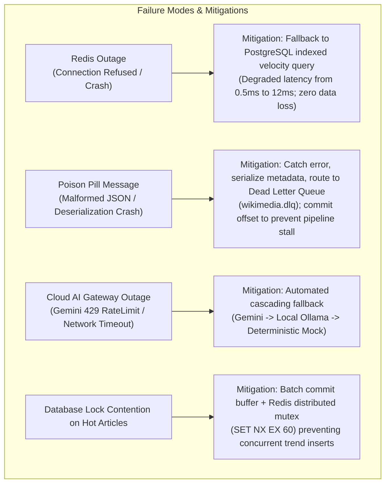

# NexusAI / WikiPulse — Production System Design & Scalability Architecture

This document provides the **system design specification, capacity planning formulas, failure mode analyses, and horizontal scaling roadmaps** for the NexusAI platform.

---

## 1. Requirements & Non-Functional Requirements (NFRs)

### Functional Requirements
1. **Continuous Ingestion:** Ingest real-time Wikipedia revision streams ($\sim 50 - 500\text{ edits/sec}$ steady state).
2. **Velocity Tracking:** Maintain rolling edit velocity counters per article over 1-minute, 5-minute, and 15-minute sliding windows.
3. **Automated Spike Detection:** Trigger trend alerts when an article's edit velocity exceeds $\ge 3.0\times$ its 15-minute historical baseline with $> 3$ unique active editors.
4. **Hybrid Knowledge Retrieval:** Provide sub-50ms hybrid search combining pgvector semantic search and PostgreSQL GIN lexical search via Reciprocal Rank Fusion ($k=60$).
5. **Grounded AI Synthesis:** Synthesize factual change summaries with verified revision citations and prompt injection defense.

### Non-Functional Requirements (SLAs)

| Dimension | Target SLA | Implementation Mechanism |
| :--- | :--- | :--- |
| **API p95 Read Latency** | $< 50\text{ ms}$ (Hybrid Search) | Dual-index parallel query + in-memory RRF fusion. |
| **Ingestion Throughput** | $\ge 2,500\text{ events/sec}$ | Decoupled Kafka streaming + asynchronous batch workers. |
| **Spike Detection Latency** | $< 2.0\text{ seconds}$ from edit | Redis ZSET sorted sets + sliding window score aggregation. |
| **Availability** | $99.9\%$ uptime | Multi-provider AI fallback cascade (Gemini $\to$ Ollama $\to$ Mock). |
| **Delivery Guarantee** | Strict At-Least-Once | Manual Kafka offset commits + PostgreSQL `ProcessingJob` idempotency. |

---

## 2. Capacity Planning & Quantitative Estimations

### A. Storage Sizing & Daily Write Volume
* **Ingestion Rate:** $150\text{ events/sec}$ average, $1,000\text{ events/sec}$ peak.
* **Daily Event Count:** $150\text{ events/sec} \times 86,400\text{ sec/day} \approx 13.0\text{ Million edits/day}$.
* **Average Payload Size:**
  * Raw JSON: $\sim 1.5\text{ KB}$
  * Normalized PostgreSQL Row (`edits` table): $\sim 350\text{ Bytes}$
  * Knowledge Chunk with 384d Vector: $\sim 500\text{ Bytes (text)} + (384 \times 4\text{ Bytes}) \approx 2.0\text{ KB}$
* **Daily Storage Ingress:**
  $$\text{Storage/day} = 13.0\text{M} \times (350\text{B} + 2.0\text{KB}) \approx 30.55\text{ GB/day}$$
  * Annual Storage Requirement (without retention pruning): $\sim 11.15\text{ TB/year}$.
  * Retention Policy: Retain full edit deltas for 30 days ($916\text{ GB}$), retain aggregated article rollups indefinitely.

---

### B. Redis In-Memory Sliding Window RAM Sizing
* **Active Articles Tracked Simultaneously:** $\sim 25,000$ active articles.
* **Average Edits per Active Article (1-hour TTL):** $\sim 20$ edits.
* **ZSET Memory Overhead per Entry:** $\sim 64\text{ Bytes}$ (member string + 8-byte score).
* **Total Redis RAM Calculation:**
  $$\text{RAM} = 25,000\text{ articles} \times 20\text{ entries} \times 64\text{ Bytes} \times 3\text{ (edits, editors, bytes keys)} \approx 96.0\text{ MB}$$
  * With Redis internal dict overhead ($1.5\times$), working set comfortably fits within $\mathbf{< 256\text{ MB}}$ RAM.

---

### C. Kafka Partition Sizing Formula
To determine the number of Kafka partitions ($P$) and worker instances ($W$) required to sustain peak ingestion volume ($R_{\text{peak}} = 5,000\text{ msg/sec}$):

$$W = \left\lceil \frac{R_{\text{peak}}}{C_{\text{worker}}} \right\rceil$$

Where:
* $R_{\text{peak}} = 5,000\text{ events/sec}$
* $C_{\text{worker}} = 350\text{ events/sec}$ (measured processing capacity of a single Python async worker instance including DB write and Redis pipeline).
* Calculation:
  $$W = \left\lceil \frac{5,000}{350} \right\rceil = \mathbf{15\text{ Workers}}$$
  * Minimum Partitions: $P \ge 16$ partitions per topic to allow 1-to-1 worker thread allocation.

---

## 3. Bottleneck Analysis & Failure Scenarios



---

## 4. Current vs. Future System Design Evolution

```text
┌────────────────────────────────────────────────────────────────────────────────────────────────────────┐
│ CURRENT ARCHITECTURE (Validated Single-Node Topology)                                                  │
├────────────────────────────────────────────────────────────────────────────────────────────────────────┤
│ • Ingestion: Single Stream Ingestor process (wikimedia.recentchange)                                   │
│ • Kafka: Single-broker KRaft cluster (3 partitions/topic)                                              │
│ • Database: Single PostgreSQL 16 instance with pgvector extension                                     │
│ • Caching: Single Redis 7 instance with ZSET sliding windows                                           │
│ • Workers: 4 dedicated async worker processes                                                          │
└────────────────────────────────────────────────────────────────────────────────────────────────────────┘
                                    │
                                    │ Scaling Trigger: Traffic > 50,000 events/sec
                                    ▼
┌────────────────────────────────────────────────────────────────────────────────────────────────────────┐
│ [FUTURE] DISTRIBUTED HORIZONTAL SCALING ARCHITECTURE                                                   │
├────────────────────────────────────────────────────────────────────────────────────────────────────────┤
│ • Kafka: Multi-broker cluster (3x brokers, 32 partitions, replication factor = 3, min.insync.replicas=2│
│ • Database: Primary-Replica CQRS (1x Writer + 4x Read Replicas for Hybrid Search queries)              │
│ • Vector Store: Dedicated distributed vector database (Qdrant / Milvus) for > 100M knowledge chunks     │
│ • Redis: Redis Cluster with hash slot sharding (key tags: act:{art_id})                                │
│ • Orchestration: Kubernetes Deployments with Horizontal Pod Autoscalers (HPA) scaling on consumer lag  │
└────────────────────────────────────────────────────────────────────────────────────────────────────────┘
```
