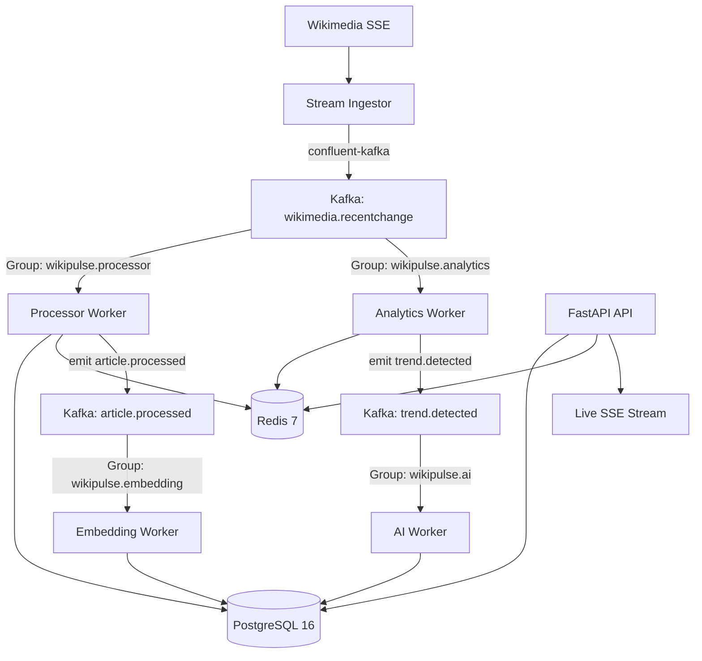

# WikiPulse / NexusAI — System Design Specification

This document provides the complete, interview-grade system design specification for WikiPulse / NexusAI.

---

## 1. Problem Definition
Real-time knowledge bases like Wikipedia generate sudden bursts of updates during breaking world events. An impedance mismatch exists between high-throughput event ingestion ($50 - 200+\text{ ev/s}$) and compute-intensive downstream operations (sliding-window velocity analytics, 384d vector embedding generation, and AI synthesis). Synchronous REST processing leads to thread starvation and dropped events.

## 2. Functional Requirements
- Ingest Wikimedia SSE real-time edit stream.
- Normalize and persist entities (`Article`, `Editor`, `Edit`) in PostgreSQL.
- Detect unusual editing velocity spikes across rolling 1m, 5m, and 15m windows in Redis.
- Vectorize knowledge summaries and execute hybrid search (pgvector + PostgreSQL FTS + RRF).
- Serve grounded AI question-answering with exact citation attribution.
- Stream live events to client dashboards via Server-Sent Events (SSE).

## 3. Non-Functional Requirements
- **Surge Durability:** Decoupled Kafka commit logs buffer spikes up to $200+\text{ ev/s}$.
- **Strict At-Least-Once Delivery:** Manual offset commits strictly after database writes succeed.
- **Application-Level Idempotency:** PostgreSQL `UNIQUE` index on `ProcessingJob.idempotency_key` prevents duplicate records during message replays.
- **Sub-50ms Search Latency:** Measured hybrid search latency average of **15.89 ms** (p95: 21.86 ms).

## 4. System Architecture

## 5. Runtime Components
- **Stream Ingestor:** Persistent HTTP SSE client normalizing raw Wikipedia payloads into `IngestedEvent`.
- **Processor Worker:** Persists relational entities and manages idempotency.
- **Analytics Worker:** Computes rolling window velocity multipliers in Redis.
- **Embedding Worker:** Vectorizes edit summaries into 384d float32 dense vectors via SentenceTransformers.
- **AI Worker & Gateway:** Synthesizes breaking trends with LLM fallback (Gemini $\to$ Ollama $\to$ Mock).
- **FastAPI Control Plane:** Serves hybrid search, AI question-answering, `/livez`/`/readyz` probes, and SSE streams.

## 6. End-to-End Data Flow
See [`docs/DATA_FLOW.md`](DATA_FLOW.md).

## 7. Kafka Architecture
- **Topic:** `wikimedia.recentchange` (3 partitions, key: `article_title`).
- **Client:** `confluent-kafka` (librdkafka C engine).
- **Producer Configuration:** `linger.ms: 5`, `acks: 1`. Non-blocking C enqueuing.
- **Consumer Configuration:** `enable.auto.commit: false`, thread-isolated polling via `asyncio.to_thread`.

## 8. PostgreSQL Architecture
- **Schema:** Relational models for `articles`, `editors`, `edits`, and `processing_jobs`.
- **Transactions:** SQLAlchemy Async with `asyncpg` binary protocol execution.
- **Idempotency Index:** `CREATE UNIQUE INDEX uq_processing_job_key ON processing_jobs(idempotency_key)`.

## 9. Redis Architecture
- **Sliding Windows:** Sorted Sets (`act:art:{id}:edits`) with timestamp scores.
- **Operations:** `ZADD`, `ZREMRANGEBYSCORE`, `ZCARD` executing in $< 0.5\text{ms}$ ($O(\log N + M)$).
- **Rate Limiting:** In-memory token bucket middleware per client IP.

## 10. Search Architecture
- **pgvector:** HNSW cosine distance index (`<=>`).
- **PostgreSQL FTS:** GIN inverted index (`to_tsvector @@ plainto_tsquery`).
- **Reciprocal Rank Fusion:** Scale-invariant fusion: $\text{RRF}(d) = \sum \frac{1}{60 + \text{rank}_i(d)}$.
- **Reranker:** Phrase match boost ($1.25\times$) and 15-minute recency decay ($1.15\times$).

## 11. Grounded RAG Architecture
- Dense 384d chunk retrieval fused with exact keyword lexical search.
- XML context fencing inside `<untrusted_wikipedia_content>`.
- Mandatory citation generation mapping to `[Article Title, Revision ID, Timestamp]`.

## 12. LLM Gateway Architecture
- Multi-provider cascading: Google Gemini Flash $\to$ Local Ollama (`llama3.2:1b`) $\to$ Deterministic Mock Provider ($0.20\text{ms}$).
- Strict Pydantic output validation against `AIAnalysisOutput`.

## 13. Worker Architecture
- Independent consumer groups allowing each worker pool to scale and process at its own rate without head-of-line blocking.

## 14. Failure Handling & Self-Healing
- See Master Failure Matrix in [`docs/FAILURE_ENGINEERING.md`](FAILURE_ENGINEERING.md).
- Poison-pill isolation: 3 retries $\to$ `wikimedia.dlq` topic dispatch.

## 15. Security & Threat Model
- Layered prompt-injection risk mitigation (regex + XML tags + Pydantic validation).
- Zero SQL injection risk via SQLAlchemy parameterization.
- Secrets isolated in environment variables.

## 16. Observability
- Prometheus metrics (`wikipulse_events_ingested_total`, `wikipulse_events_processed_total`, `wikipulse_dlq_events_total`).
- Kubernetes probe separation: `/livez` (process liveness) vs. `/readyz` (DB/Redis readiness).

## 17. Horizontal Scalability
- Consumer group parallelism: $W \le P$.
- Sizing formula: $W = \lceil R_{\text{peak}} / C_{\text{worker}} \rceil$.

## 18. Capacity Planning
- Sizing for $200\text{ ev/s}$ peak: 16 workers across 16 Kafka partitions.
- pgvector 10M chunks memory sizing: $32\text{ GB RAM}$.

## 19. Consistency Model
- PostgreSQL (authoritative system of record) and Redis (derived aggregation state) operate in **separate consistency domains** without distributed 2PC.

## 20. Architectural Tradeoffs
- Co-located pgvector vs. Standalone Vector DB: Zero dual-write lag vs. single-node RAM bounds.
- Kafka vs. RabbitMQ: Replayability and disk log vs. operational overhead.
- `confluent-kafka` vs. `aiokafka`: C-memory batching vs. thread-isolated async bridge.

## 21. Future Production Evolution
- AWS MSK (3 brokers, replication factor 3, `min.insync.replicas: 2`).
- Aurora PostgreSQL with read replicas.
- KEDA autoscaling on Kubernetes based on consumer lag.
